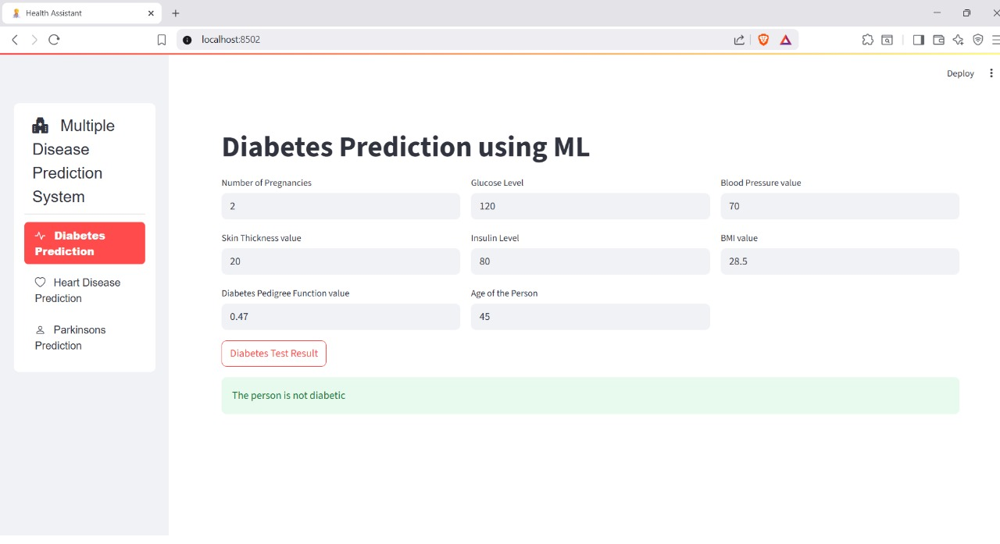
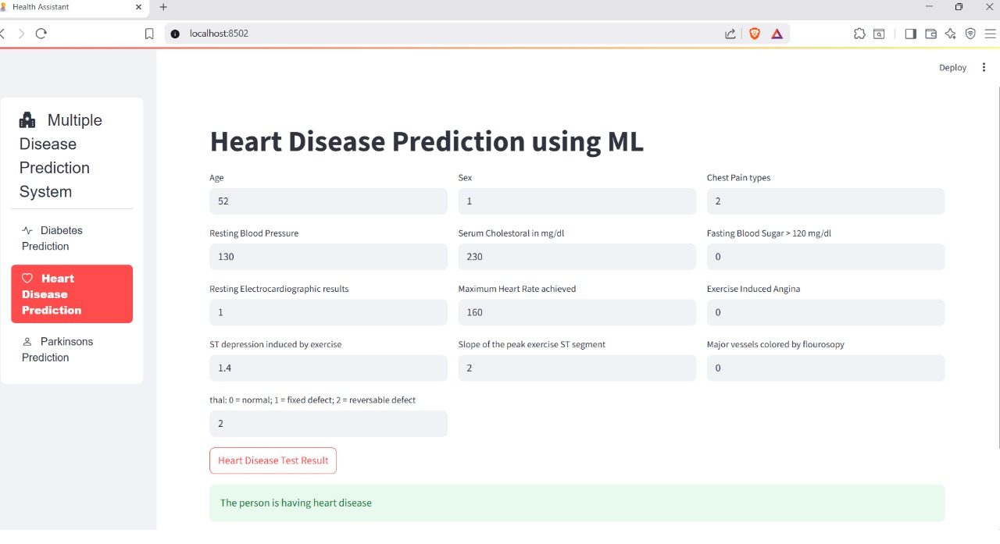
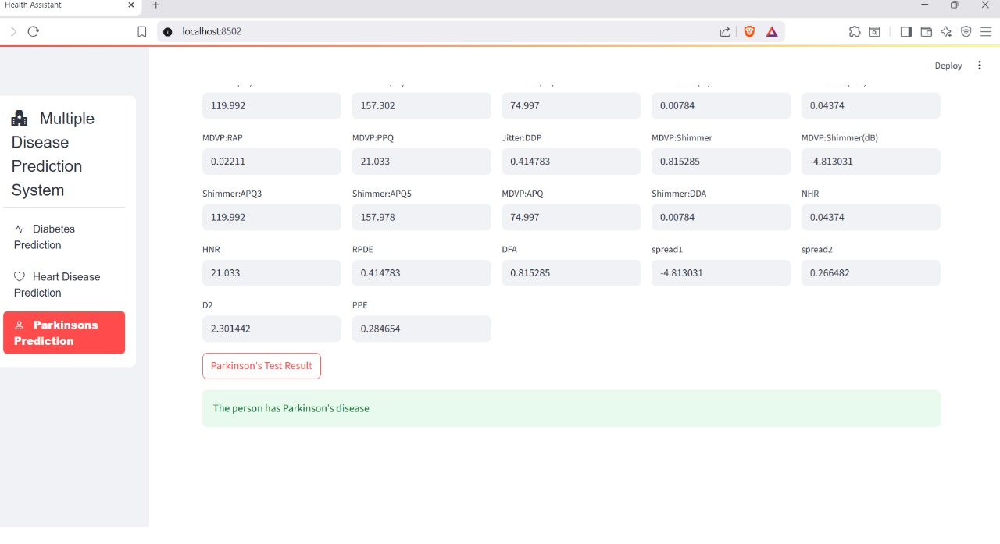

# Cardiac_Health_ML
ML-based Cardiac Health Assessment System using Python, Pandas, and Logistic Regression – designed to help identify heart disease risk.
## Output Screenshots

Prediction results for all three models (Heart, Diabetes, and Parkinson) are shown below:

- 
- 
- 

